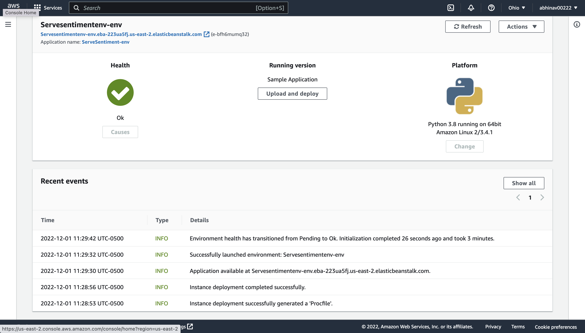

# ECE444-F2022-Lab7
Name: Abhinav Sanjeeva Prasad

Following documentations were used to deploy the ML model:
https://medium.com/swlh/deploy-a-machine-learning-model-with-aws-elasticbeanstalk-dfcc47b6043e

https://docs.aws.amazon.com/elasticbeanstalk/latest/dg/create-deploy-python-flask.html

## API Link:
https://github.com/abhinav0022/ECE444-F2022-Lab7/blob/main/api/application.py

## Test Link:
https://github.com/abhinav0022/ECE444-F2022-Lab7/tree/main/tests

## API Testing:
Used Postman: https://www.postman.com/

## Deployment Verification
